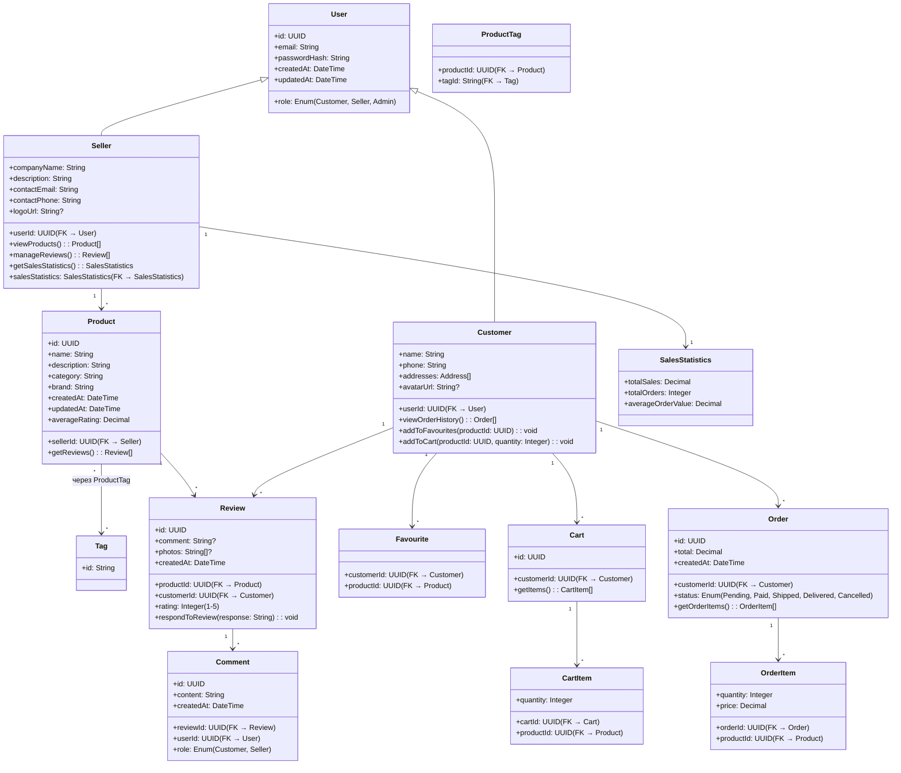

```mermaid
classDiagram
    class User {
        +id: UUID
        +email: String
        +passwordHash: String
        +role: Enum (Customer, Seller, Admin)
        +createdAt: DateTime
        +updatedAt: DateTime
    }

    class Customer {
        +userId: UUID (FK → User)
        +name: String
        +phone: String
        +addresses: Address[]
        +avatarUrl: String?
        +viewOrderHistory(): Order[]
        +addToFavourites(productId: UUID): void
        +addToCart(productId: UUID, quantity: Integer): void
    }
    
    class Comment {
        +id: UUID
        +reviewId: UUID (FK → Review)
        +userId: UUID (FK → User)
        +role: Enum (Customer, Seller)
        +content: String
        +createdAt: DateTime
    }

    class Seller {
        +userId: UUID (FK → User)
        +companyName: String
        +description: String
        +contactEmail: String
        +contactPhone: String
        +logoUrl: String?
        +viewProducts(): Product[]
        +manageReviews(): Review[]
        +getSalesStatistics(): SalesStatistics
        +salesStatistics: SalesStatistics (FK → SalesStatistics)
    }

    class Product {
        +id: UUID
        +sellerId: UUID (FK → Seller)
        +name: String
        +description: String
        +category: String
        +brand: String
        +createdAt: DateTime
        +updatedAt: DateTime
        +averageRating: Decimal
        +getReviews(): Review[]
    }

    class Tag {
        +id: String
    }

    class ProductTag {
        +productId: UUID (FK → Product)
        +tagId: String (FK → Tag)
    }

    class Review {
        +id: UUID
        +productId: UUID (FK → Product)
        +customerId: UUID (FK → Customer)
        +rating: Integer (1-5)
        +comment: String?
        +photos: String[]?
        +createdAt: DateTime
        +respondToReview(response: String): void
    }

    class Favourite {
        +customerId: UUID (FK → Customer)
        +productId: UUID (FK → Product)
    }

    class Cart {
        +id: UUID
        +customerId: UUID (FK → Customer)
        +getItems(): CartItem[]
    }

    class CartItem {
        +cartId: UUID (FK → Cart)
        +productId: UUID (FK → Product)
        +quantity: Integer
    }

    class Order {
        +id: UUID
        +customerId: UUID (FK → Customer)
        +status: Enum (Pending, Paid, Shipped, Delivered, Cancelled)
        +total: Decimal
        +createdAt: DateTime
        +getOrderItems(): OrderItem[]
    }

    class OrderItem {
        +orderId: UUID (FK → Order)
        +productId: UUID (FK → Product)
        +quantity: Integer
        +price: Decimal
    }

    class SalesStatistics {
        +totalSales: Decimal
        +totalOrders: Integer
        +averageOrderValue: Decimal
    }

    User <|-- Customer
    User <|-- Seller
    Seller "1" --> "1" SalesStatistics
    Review "1" --> "*" Comment
    Seller "1" --> "*" Product
    Product "*" --> "*" Tag : через ProductTag
    Product "1" --> "*" Review
    Customer "1" --> "*" Review
    Customer "1" --> "*" Favourite
    Customer "1" --> "*" Cart
    Cart "1" --> "*" CartItem
    Customer "1" --> "*" Order
    Order "1" --> "*" OrderItem
```